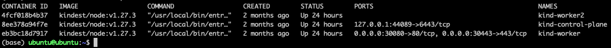
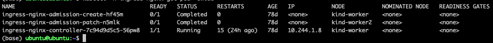
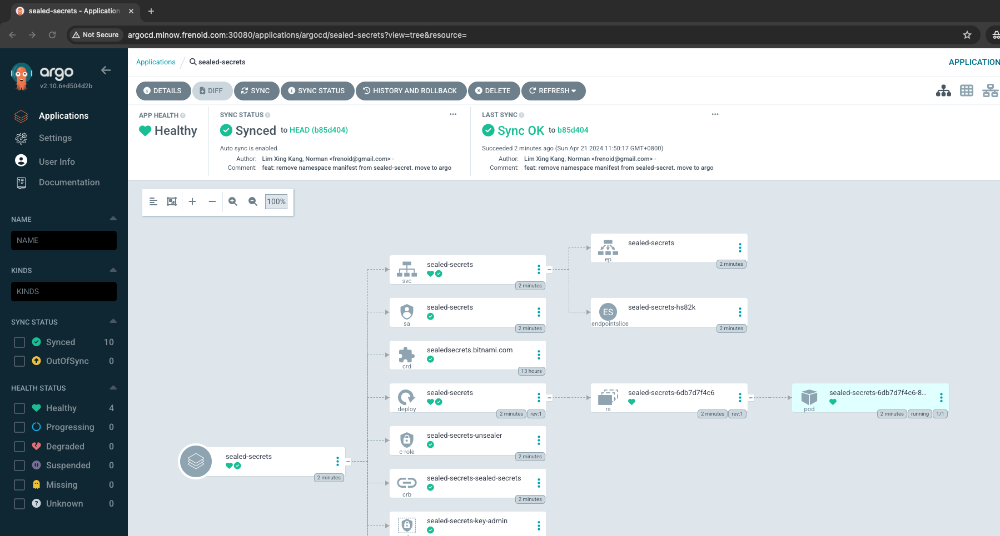
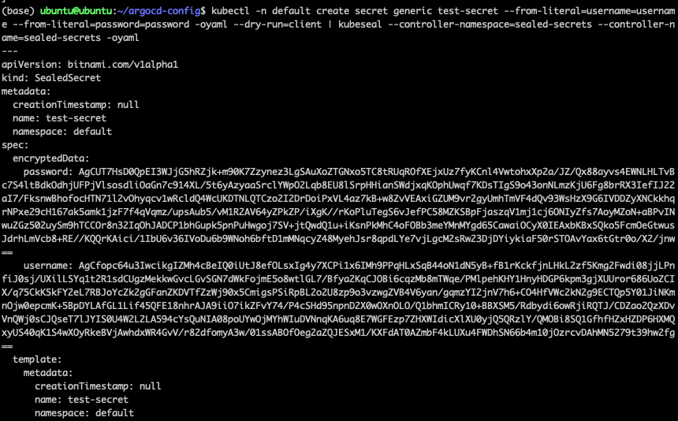
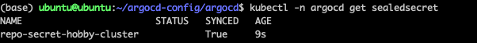
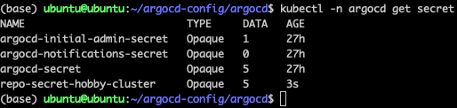

# ArgoCD and Application configurations
Want __GitOps__ and __Kubernetes__ on a single machine? Look no further!

This repo stores configurations to install
1. A kind cluster
2. Nginx Ingress controller
3. ArgoCD
4. Sealed Secrets
5. Other applications in [hobby-cluster](https://github.com/frenoid/hobby-cluster)<br><br>

## Bootstrapping
First, create a Kubernetes cluster using kind. <br><br>

### Create a kind cluster
[docker](https://www.docker.com/) and [kind](https://kind.sigs.k8s.io/) must be installed.<br>

Next, create a kind cluster using the kind cli and cluster config file<br>
`kind create cluster --config ./kind-cluster/cluster-config.yaml`

1 master node and 2 worker nodes are created using docker containers<br>
Note that 1 of the worker nodes has ports 30080 and 30443 exposed on the host machine for ingress<br>
Observe this by running<br>
`docker ps`
<br><br>

### Install the Nginx Ingress Controller
Create a namespace for the nginx ingress controller<br>
`kubectl create ns ingress-nginx`<br>

Install nginx-ingress controller<br>
`kubectl -n ingress-nginx apply -f ./kind-cluster/ingress-nginx.yaml`<br>

Check that the ingress pod is running on worker 1<br>
`kubectl -n ingress-nginx get pod -owide`<br>
<br>

Test that the http ingress port is working <br>
`curl http://localhost:30080`<br>

Test that the https ingress port is working <br>
`curl https://localhost:30443 --insecure` <br>
<br><br>

### Install ArgoCD
Create an argocd namespace<br>
`kubectl create ns argocd`

Install the ArgoCD resources<br>
`kubectl -nargocd apply -f argocd/install.yaml`

Install the ArgoCD ingress<br>
`kubectl -nargocd apply -f argocd/ingress.yaml`

Get the ArgoCD admin password<br>
`kubectl -n argocd get secret argocd-initial-admin-secret -o jsonpath="{.data.password}" | base64 -d`<br>

Log into the ArgoCD at [http://argocd.mlnow.frenoid.com:30080/](http://argocd.mlnow.frenoid.com:30080/)<br>
Username: *admin*<br>
Password: *argoCDAdminPassword*<br><br>

### Install the repository secret
Install the repo-secret for hobby-cluster

In [./argocd/repo-secret.yaml](./argocd/repo-secret.yaml), You will see <br>

```yaml
apiVersion: v1
kind: Secret
metadata:
  annotations:
    managed-by: argocd.argoproj.io
  labels:
    argocd.argoproj.io/secret-type: repository
  name: repo-secret-hobby-cluster
  namespace: argocd
type: Opaque
stringData:
  name: "kind-configs"
  project: "default"
  type: "git"
  url: "git@github.com:frenoid/hobby-cluster.git"
  sshPrivateKey: |
    <replaceMe>
```

Replace the `<replaceMe>` with the private key used to access the github repo and apply the secret <br>
`kubectl -nargocd apply -f argocd/repo-secret.yaml`<br><br>

## Install the sealed-secrets application
The sealed-secrets application is needed to decrypt secrets and is a pre-requisite install [other applications](/argocd-configs/applications/)<br><br>

### Install the ArgoCD application
`kubectl apply -f applications/sealed-secrets.yaml`<br>

Go to ArgoCD UI and you will see that the sealed-secrets application has been installed<br>
<br><br>

### Install the kubeseal binary
The kubeseal binary will allow you to encrypt/decrypt SealedSecrets. It obtains the public certificate from a secret in the Kubernetes cluster's sealed-secrets namespace<br>

Install the kubeseal binary.<br>
```sh
https://github.com/bitnami-labs/sealed-secrets/releases/download/v0.26.2/kubeseal-0.26.2-linux-amd64.tar.gz
tar -xvzf kubeseal-0.26.2-linux-amd64.tar.gz kubeseal
sudo install -m 755 kubeseal /usr/local/bin/kubeseal
```
<br>

Retrieve the tls.crt and concatenate it into a file<br>
```bash
kubeseal \
  --controller-namespace=sealed-secrets \
  --controller-name=sealed-secrets \
  --fetch-cert > ~/.ssh/kubeseal.crt
```
<br>
Test you are able to encrypt secrets using kubeseal<br>

```bash
kubectl -n default \
  create secret generic test-secret \
  --from-literal=username=username \
  --from-literal=password=password \
  -oyaml \
  --dry-run=client | kubeseal \
  --controller-namespace=sealed-secrets \
  --controller-name=sealed-secrets
```

<br><br>

### Replace the repo-secret-hobby-cluster with a Sealed Secret
Now, we will replace previously create *repo-secret-hobby-cluster* secret with a Sealed Secret<br>

First, we patch the existing secret with a annotation allowing the secret to be overwritten when a Sealed Secret unsealed in the same name and namespace<br>
```bash
kubectl -n argocd \
  patch secret repo-secret-hobby-cluster \
  -p '{"metadata": {"annotations": {"sealedsecrets.bitnami.com/managed": "true"}}}'
```
<br>

Next, we create a Sealed Secret from the existing repo secret<br>
```bash
kubectl -n argocd \
  get secret repo-secret-hobby-cluster -oyaml \
  | kubeseal --controller-namespace=sealed-secrets \
  --controller-name=sealed-secrets \
  --name repo-secret-hobby-cluster \
  --format yaml \
  -w sealed-secret-repo-secret-hobby-cluster.yaml
```
<br>

We can now create the Sealed Secret<br>
`kubectl apply -f sealed-secret-repo-secret-hobby-cluster.yaml`<br>

Check that the Sealed Secret was created successfully<br>
`kubectl -n argocd get sealedsecret`<br>
<br>

The secret *repo-secret-hobby-cluster* is now being managed by the Sealed Secrets controller and will be synced if the associated Sealed Secret changes<br>

You can see this by deleting the secret *repo-secret-hobby-cluster*<br>
`kubectl -n argocd delete secret repo-secret-hobby-cluster`<br>

Now see that the secret is re-created almost instantaneously.<br>
`kubectl -n argocd get secret`
<br>

Sealed Secrets are protected by asymmetric encryption. The public key can be used to encrypt the secret but only the private key, controlled by the Sealed Secrets controller in the cluster can decrypt the secret<br>

It is safe to commit both the [Sealed Secret](/argocd-configs/argocd/sealed-secret-repo-secret-hobby-cluster.yaml) and the [public key](/argocd-configs/argocd/kubeseal.crt) to the code repository

However the private key used by the Sealed Secrets controller must remain a secret.

## What's next?
Install even more applications by going [here](/argocd-configs/applications/) !
